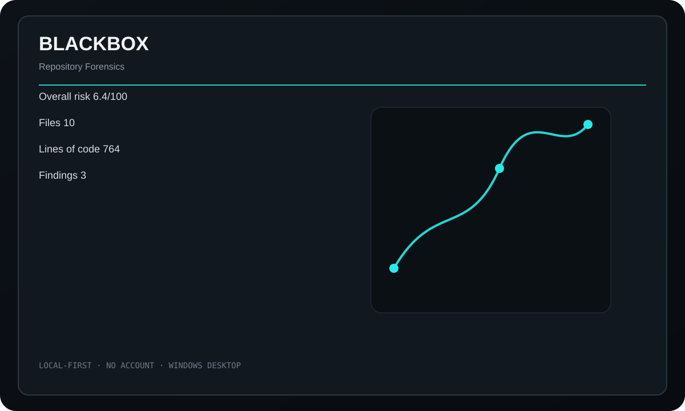

<div align="center">
  
  <h1>BLACKBOX</h1>
  <p><strong>Local repository forensics for structure, hotspots, risks, dependencies, and suspicious code patterns.</strong></p>
  <p>
    <a href="https://github.com/purysho/BLACKBOX/actions/workflows/ci.yml"></a>
    <a href="https://github.com/purysho/BLACKBOX/releases"></a>
    <a href="LICENSE"></a>
  </p>
  <p><a href="https://github.com/purysho/BLACKBOX/releases"><strong>Download for Windows</strong></a> · <a href="#run-from-source">Run from source</a> · <a href="https://github.com/purysho/BLACKBOX/issues">Report an issue</a></p>
</div>



## What it does

- Repository structure and language mix
- Large files and code hotspots
- TODO/FIXME-style findings and suspicious-pattern signals
- Dependency and cycle signals
- Git repository context
- Exportable JSON reports

## Download

Tagged releases are built on `windows-latest` by GitHub Actions. Each release contains `BLACKBOX.exe` and `BLACKBOX.exe.sha256`. The executable is produced from the source at that tag with PyInstaller.

> Until the first tagged release is published, the latest Windows build is available as the **BLACKBOX-windows** artifact on successful CI runs.

## Run from source

Requirements: Python 3.10+ with Tk support.

```powershell
pyw blackbox_desktop.pyw
```

The application uses Python's standard library at runtime.

## Build a standalone Windows executable

```powershell
powershell -ExecutionPolicy Bypass -File .\build-windows.ps1
```

Output:

```text
dist\BLACKBOX.exe
```

## Privacy

Scanning happens locally. BLACKBOX does not require an account, backend, or source-code upload.

## Scope

BLACKBOX is a first-pass forensic view, not a compiler-grade static analyzer. Findings are investigation signals rather than proof that code is unsafe or defective.

## Release process

- Every push runs tests/compile checks and builds a Windows executable artifact.
- Tags matching `v*` build the executable again, compute SHA256, and publish both files to GitHub Releases.
- See [CHANGELOG.md](CHANGELOG.md) for release history.

## License

MIT
